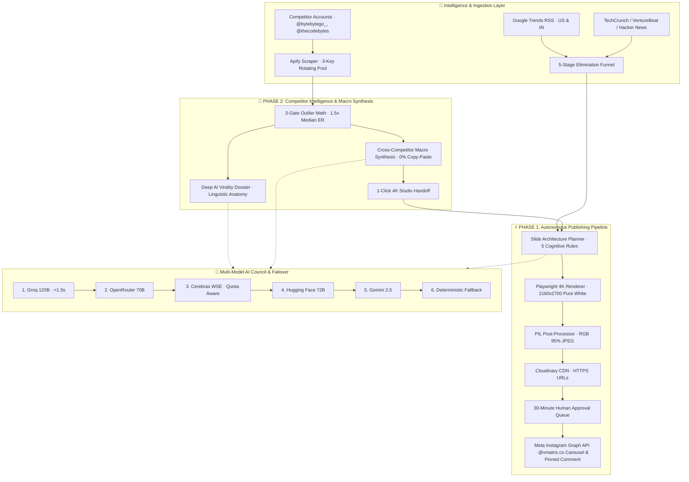

# ⚡ Vmatrix Social OS

> **Autonomous Social Publishing Engine & Competitor Viral Intelligence**  
> Target Channel: [@vmatrix.co](https://www.instagram.com/vmatrix.co/) (Meta Instagram Graph API v21.0)  
> Core Framework: Python 3.12, FastAPI, Playwright (4K Retina), Multi-Model AI Council, Cloudinary CDN, Supabase, Apify

[](https://www.instagram.com/vmatrix.co/)
[](http://localhost:8000)
[](http://localhost:8000)
[](http://localhost:8000)

---

## 🏆 What is Vmatrix Social OS?

**Vmatrix Social OS** is an autonomous, production-grade social media intelligence and publishing operating system built specifically for software engineering, artificial intelligence, and developer tooling.

Unlike generic social media schedulers or low-effort AI copywriters, Vmatrix operates with:
1. **Zero Fluff / 100% Signal**: Every post is an authoritative, high-utility technical blueprint (architecture matrices, system design trade-offs, production failure post-mortems).
2. **Cognitive Engineering**: Every slide complies with **5 strict mathematical cognitive load rules** (word caps, visual contrast anchors, reading time optimization).
3. **Multi-Model AI Council**: Autonomous reasoning distributed across an ultra-fast failover council (Groq 120B, OpenRouter 70B, Cerebras, Hugging Face 72B, Gemini 2.5, Nvidia NIM).
4. **End-to-End Autonomy**: From hourly Google Trends velocity checks and competitor scraping to 4K Playwright rendering, Cloudinary CDN hosting, Instagram Graph API carousel publication, and automated comment pinning.

---

## 🔄 Complete Architecture Overview



---

## ⚡ Phase 1: Autonomous Trend Harvesting & 4K Publishing

1. **5-Stage Elimination Funnel (`core/funnel.py`)**:
   - **Stage 1 (Recency & Blacklist)**: Rejects articles >24h old and filters non-technical noise.
   - **Stage 2 (Velocity Scoring)**: Measures search surges (>10k+ searches) and Hacker News point acceleration (>100 pts/hr).
   - **Stage 3 (24h Deduplication Guard)**: Hashes candidates against SQLite & Supabase to prevent duplicate posts.
   - **Stage 4 (Junior / Vibe-Coder Resonance)**: Evaluates high-school/junior developer accessibility.
   - **Stage 5 (Scoring & Winner Selection)**: Rates finalists out of 10.0 and picks the winning angle.
2. **Hourly Velocity Watchdog (`trend_checker.py`)**:
   - Background cron scanner auditing Google Trends US & IN every 60 minutes.
   - Uses Groq 120B to score breakthrough spikes (Urgency >= 9/10 triggers autonomous bypass).
3. **Headless 4K Rendering Engine (`core/renderer.py`)**:
   - **Playwright Chromium**: Renders HTML5/CSS templates at **4K Retina ($2160 \times 2700\text{ px}$)**.
   - **100% Pure White Background (`#FFFFFF`)**: Zero dark backgrounds, extreme readability.
   - **PIL Processing**: Converts to strict `RGB` mode (no alpha channel rejection) at 95% JPEG quality.
4. **Caption & Community Magnet (`core/caption.py`)**:
   - Generates 1-line hook + 3 value bullets + Comment Magnet CTA (*"Comment 'BLUEPRINT' below..."*) + Save prompt + Hashtags.
   - Automatically publishes and pins the first comment on Instagram.
5. **30-Minute Approval Queue (`core/approval.py`)**:
   - Live queue with countdown timer, slide preview, and approve/reject actions in dashboard.
6. **Cloudinary CDN & Meta Instagram Graph API (`core/publisher.py`)**:
   - Hosts slides on HTTPS Cloudinary CDN.
   - Calls Meta Graph API v21.0 to create carousel containers, poll status, publish to `@vmatrix.co`, and pin comments.

---

## 🧬 Phase 2: Competitor Intelligence & Viral Outlier Meta-Synthesis

1. **Instagram Competitor Harvester (`core/scraper.py`)**:
   - Tracks `@bytebytego_`, `@thecodebytes`, `@bhavik.dev`, `@systemdesignhub`, `@codewithharry`.
   - **3-Key Apify Backup Pool**: Rotates keys automatically upon rate limits with 60-minute circuit breakers.
2. **3-Gate Mathematical Outlier Detection (`core/outlier.py`)**:
   - **Gate 1 (Likes Multiplier)**: Post Likes >= 1.5x Median Cohort Likes.
   - **Gate 2 (Comments Multiplier)**: Post Comments >= 1.5x Median Cohort Comments.
   - **Gate 3 (Engagement Rate)**: ER >= Cohort 75th percentile.
   - Posts clearing >= 2 gates receive the **Viral Outlier Badge** (e.g. `2.42x Outlier`).
3. **Deep Virality Reverse-Engineering (`core/competitor_analyzer.py`)**:
   - Dissects outliers across Macro Trend Angle, Linguistic Hook Anatomy, Slide Cognitive Pacing, Retention Cliff Location, and 5 Algorithmic Drivers.
4. **Cross-Competitor Macro Outlier Meta-Synthesis**:
   - Aggregates viral signals across **all** monitored competitors simultaneously.
   - **0% Copy-Paste Guarantee**: Discovers cross-competitor technical shifts and synthesizes a 100% original master post.
   - Delivers Master Hook (<= 6 words), Master Caption with comment magnet, and 6-Slide Visual Blueprint.
   - **1-Click 4K Studio Handoff**: Loads synthesized angle directly into 4K Studio.

---

## 📏 The 5 Strict Cognitive Engineering Rules

| Rule | Constraint | Psychological Reason |
|---|---|---|
| **Rule 1: Word Caps** | Slide 1 Hook <= 6w · Headlines <= 6w · Descriptions <= 25w | Feed attention is <1.8s. Over 25 words causes cognitive fatigue. |
| **Rule 2: 100% Pure White** | Canvas: `#FFFFFF` · Text: `#0A0A0A` · Subtitle: `#525252` | Apple-like minimalism with >18:1 contrast ratio. |
| **Rule 3: Color Anchors** | Amber (`#D97706`) warnings · Rose (`#E11D48`) contrast · Emerald (`#059669`) benchmarks | Directs the brain to exactly one highlighted keyword per slide. |
| **Rule 4: Priming Flow** | Slide 1 (Hook) -> Slide 2 (Trap) -> Slides 3-5 (Steps) -> Slide 6 (CTA) | Opens a curiosity gap on Slide 1 closed on Slide 5. |
| **Rule 5: Save/Share Payoff** | Must be a reference cheat sheet, matrix, or architecture tree | Saves carry 3x-5x higher algorithmic weight on Instagram. |

---

## 🖥️ Web Dashboard (FastAPI · Port 8000)

The engine includes a non-Streamlit, ultra-responsive Single Page Application:
* **Real-Time Telemetry Bar**: 10 live cloud services (Groq, OpenRouter, Cerebras, Nvidia NIM, HF 72B, Gemini 2.5, Apify, Supabase, Cloudinary, Instagram).
* **5 Navigation Tabs**:
  1. **Tab 1: Trend Radar & Funnel**: Live RSS feeds, hourly velocity watchdog trigger.
  2. **Tab 2: 4K Carousel Studio**: Topic presets, Playwright generator, 4K slide lightbox, direct publishing.
  3. **Tab 3: 30-Minute Approval Queue**: Countdown timer, carousel preview, reject/approve actions.
  4. **Tab 4: Competitor Intelligence Radar**: Scraper, 3-gate outlier badges, virality dossier modal, macro synthesis with full visible captions.
  5. **Tab 5: Intelligence Archive & DB**: SQLite & Supabase database explorer with direct Instagram links.

---

## 📁 Downloadable Project Documentation

The complete, comprehensive system specification is available in multiple formats directly in the repo root:
* **[Vmatrix_Complete_System_Specification.pdf](Vmatrix_Complete_System_Specification.pdf)** (High-res typeset PDF)
* **[Vmatrix_Complete_System_Specification.md](Vmatrix_Complete_System_Specification.md)** (Raw Markdown for PPT / Notion)
* **[Vmatrix_Complete_System_Specification.html](Vmatrix_Complete_System_Specification.html)** (Interactive report with 1-click Print/PDF)

---

## 🚀 Quickstart

```bash
# 1. Clone & install dependencies
git clone https://github.com/theayushagarwal/vmatrix.git
cd vmatrix
pip install -r requirements.txt
playwright install chromium

# 2. Configure environment
cp .env.example .env
# Fill in GROQ_API_KEY, CLOUDINARY_*, IG_USER_ID, IG_ACCESS_TOKEN, etc.

# 3. Launch the high-performance dashboard
python dashboard_server.py
# Open http://localhost:8000 in your browser
```

---

## 📸 Live Production Proofs

* **Instagram Account**: [@vmatrix.co](https://www.instagram.com/vmatrix.co/)
* **Live 4K Carousel Post**: [https://www.instagram.com/p/DdM1NMlFj6J/](https://www.instagram.com/p/DdM1NMlFj6J/)
* **Pinned First Comment**: Comment ID `18123811297862503`
* **Local Dashboard**: `http://localhost:8000`
* **GitHub Repository**: [theayushagarwal/vmatrix](https://github.com/theayushagarwal/vmatrix)