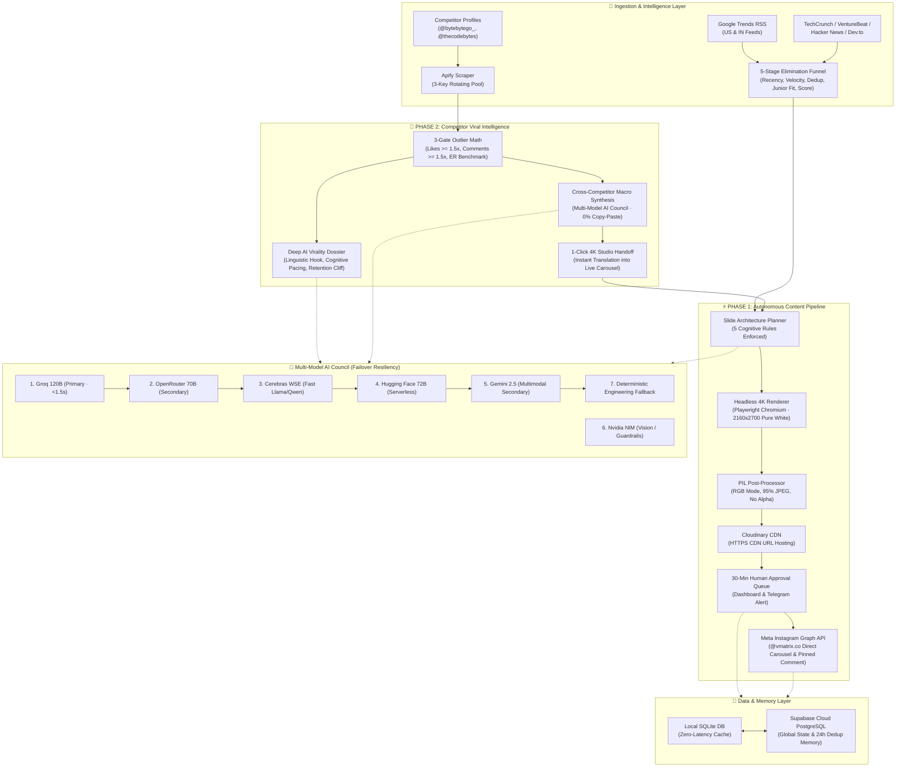

# Vmatrix Social OS · Complete System Architecture & Product Blueprint

> **Autonomous Social Publishing Engine & Competitor Viral Intelligence**  
> Target Channel: [`@vmatrix.co`](https://www.instagram.com/vmatrix.co/) (Meta Instagram Graph API)  
> Core Framework: Python 3.12, FastAPI, Playwright, Multi-Model AI Council, Cloudinary CDN, Supabase, Apify

---

## 1. Executive Summary & Mission

**Vmatrix Social OS** is an autonomous, production-grade social media intelligence and content generation operating system designed specifically for software engineering, artificial intelligence, and developer tooling.

Unlike generic social media schedulers or AI wrapper copywriters, Vmatrix operates with:
1. **Zero Fluff / 100% Signal**: No low-effort motivational quotes or generic AI jargon. Every post is an authoritative, bookmarkable technical blueprint (decision matrices, system design tradeoffs, production failure post-mortems).
2. **Cognitive Engineering**: Every slide strictly complies with 5 mathematical cognitive load rules (word caps, visual contrast anchors, reading time optimization).
3. **Multi-Model AI Council**: Autonomous reasoning distributed across an ultra-fast, resilient failover council (Groq 120B, OpenRouter 70B, Cerebras, Hugging Face 72B, Gemini 2.5, Nvidia NIM).
4. **End-to-End Autonomy**: From hourly Google Trends velocity checks and competitor scraping to 4K Playwright rendering, Cloudinary CDN uploading, Instagram Graph API carousel publication, and automated comment pinning.

---

## 2. System Architecture Diagram



---

## 3. Detailed Component Breakdown

### Phase 1: Autonomous 4K Publishing Pipeline

Phase 1 transforms raw developer news and trending search spikes into high-retention 4K carousels published directly to Instagram.

#### 1. 5-Stage Elimination Funnel (`core/funnel.py`)
Incoming topics from Google Trends RSS, Hacker News, and TechCrunch pass through 5 strict algorithmic filters:
- **Stage 1: Recency & Relevance Filter**: Rejects articles published $>24$ hours ago. Filters against a positive technical lexicon (`AI`, `LLM`, `System Design`, `Database`, `Backend`, `DevOps`) and negative fluff lexicon (`crypto pump`, `gossip`, `celebrity`).
- **Stage 2: Velocity & Spike Scoring**: Evaluates momentum. Calculates search interest surges ($>10\text{k}+$ searches, top 5 position) and Hacker News point acceleration ($>100\text{ points/hour}$).
- **Stage 3: 24-Hour Deduplication Guard**: Hashes candidate topics and compares them against the SQLite `post_history` and Supabase archive. Prevents redundant posts on the same underlying news event within 24 hours.
- **Stage 4: High-School & Junior Developer Resonance Filter**: Evaluates whether the topic can be understood and executed by a junior developer, high-school coder, or vibe coder. Filters out dense academic notation.
- **Stage 5: Finalist Selection & Scoring**: Scores finalists out of 10.0 based on technical depth, visualizability, and controversy/discussion potential. Top score enters content generation.

#### 2. Hourly Trend Velocity Watchdog (`trend_checker.py`)
- Background cron runner scanning US (`geo=US`) and India (`geo=IN`) Google Trends RSS every 60 minutes.
- Uses Groq 120B to evaluate if a breaking topic has an urgency score $\ge 9/10$.
- If a breakthrough is detected, it automatically bypasses standard queues, renders a carousel, and notifies the operator.

#### 3. 4K Headless Rendering Engine (`core/renderer.py`)
- **Technology**: Playwright (Headless Chromium).
- **Resolution**: **4K Retina Quality**: $2160 \times 2700\text{ px}$ (2x device scale from base $1080 \times 1350$ aspect ratio $4:5$).
- **Aesthetic**: **100% Pure White Background (`#FFFFFF`)**. No dark backgrounds, no muddy gradients. High-contrast typography (`#0A0A0A` text, `#525252` subtitles).
- **Post-Processing Pipeline**:
  1. HTML5 template injection with scoped Tailwind CSS.
  2. Playwright screenshot captured at high DPI.
  3. PIL (Pillow) post-processing: Converts to strict `RGB` mode (eliminating PNG alpha channels that fail Instagram's API), applies subtle unsharp masking for crisp text edges, and saves as 95% quality JPEG.

#### 4. Automated Caption & Community Magnet (`core/caption.py`)
- Generates high-converting Instagram caption architecture:
  - **First Line Hook**: Max 8 words, emoji prefix, intriguing premise.
  - **Micro-Value Bullets**: 3-4 bullet points highlighting the core lesson.
  - **Comment Magnet CTA**: Direct prompt: *"Comment 'SWARM' below and I'll send you the architecture matrix."* (Triggers Instagram algorithm's comment-velocity boost).
  - **Save Trigger**: *"📌 Bookmark this for your next system design interview."*
  - **Targeted Hashtags**: 8-12 niche engineering tags.
- **Auto-Comment Pinning**: Instantly creates and pins the first comment on the newly published post to kickstart engagement.

#### 5. 30-Minute Human Approval Queue (`core/approval.py`)
- All generated posts enter an in-memory & SQLite-backed queue.
- Operators can review 4K slide previews, edit captions, and approve/reject directly from Tab 3 of the dashboard.
- Configurable auto-publish timeout: If 30 minutes pass without human rejection, the engine can automatically publish or hold based on policy.

#### 6. CDN & Instagram Publication Pipeline (`core/publisher.py`)
- **Cloudinary CDN**: Uploads 4K JPEG slides to Cloudinary using HTTPS asset delivery. Instagram requires publicly accessible HTTPS URLs with valid image content-type headers.
- **Meta Instagram Graph API v21.0**:
  1. Calls `POST /{ig-user-id}/media` for each slide with `is_carousel_item=true`.
  2. Polls `GET /{container-id}?fields=status_code` until `FINISHED`.
  3. Calls `POST /{ig-user-id}/media` with `media_type=CAROUSEL` and children container IDs.
  4. Calls `POST /{ig-user-id}/media_publish` with the carousel ID.
  5. Calls `POST /{media-id}/comments` to post the first comment.
  6. Records media ID, permalink (`https://www.instagram.com/p/{shortcode}/`), timestamp, and status to SQLite & Supabase.

---

### Phase 2: Competitor Intelligence & Viral Outlier Meta-Synthesis

Phase 2 reverse-engineers top-performing competitor accounts and synthesizes cross-competitor viral signals into completely original high-authority posts.

#### 1. Instagram Profile Harvester (`core/scraper.py`)
- Tracks top competitor handles: `@bytebytego_`, `@thecodebytes`, `@bhavik.dev`, `@systemdesignhub`, `@codewithharry`.
- Uses Apify actors (`apify/instagram-scraper`) with:
  - **3-Key Rotating Backup Pool**: Automatically shifts between 3 API keys upon rate limits or credit depletion.
  - **Circuit Breaker**: Enforces a 60-minute cooldown per handle to prevent Instagram bot detection and API waste.
  - **Local SQLite Cache**: Returns stored posts instantly if the network scraper is in cooldown.

#### 2. 3-Gate Mathematical Outlier Detection (`core/outlier.py`)
A competitor post is not viral simply because an account has many followers. The system runs every post through 3 mathematical statistical gates:
1. **Gate 1: Likes Multiplier Gate**:
   $$\text{Multiplier}_{\text{Likes}} = \frac{\text{Post Likes}}{\text{Cohort Median Likes}} \ge 1.5\text{x}$$
2. **Gate 2: Comments Multiplier Gate**:
   $$\text{Multiplier}_{\text{Comments}} = \frac{\text{Post Comments}}{\text{Cohort Median Comments}} \ge 1.5\text{x}$$
3. **Gate 3: Engagement Rate (ER) Benchmark Gate**:
   $$\text{ER} = \frac{\text{Likes} + \text{Comments}}{\text{Estimated Reach / Followers}} \times 100 \ge \text{Cohort 75th Percentile}$$
- Posts meeting **$\ge 2$ gates** are officially flagged as **Viral Outliers** with their exact multiplier (e.g., `2.42x Outlier`).

#### 3. Deep AI Virality Reverse-Engineering (`core/competitor_analyzer.py`)
Each outlier is audited by Groq 120B / OpenRouter 70B across 5 dimensions:
1. **Macro Trend Angle**: What macro architectural shift or industry tension does this post exploit?
2. **Hook Mechanics & Linguistic Anatomy**: Exact hook type (contrarian command, curiosity gap, loss aversion), reading time ($\le 1.8\text{s}$), and swipe probability.
3. **Slide Structure & Cognitive Pacing**: Visual density rating, cognitive load score ($/10$), and retention cliff identification (where viewers drop off).
4. **Caption Architecture**: First-line hook, save/share triggers, CTA effectiveness.
5. **Why It Went Viral**: 5 distinct psychological and algorithmic reasons.
6. **Vmatrix 4K Pure-White Adaptation**: A complete 6-slide adaptation blueprint applying the 5 Cognitive Rules.

#### 4. Cross-Competitor Macro Outlier Meta-Synthesis
- Aggregates outlier signals across **all** monitored competitor accounts simultaneously.
- **0% Copy-Paste Guarantee**: Rather than copying a competitor, the AI Council discovers the *macro convergence* (e.g., all competitors are talking about microservice fatigue and database bottlenecks).
- Synthesizes a composite master carousel that combines:
  - The contrast clarity of `@bytebytego_`
  - The architectural precision of `@thecodebytes`
  - The clean, junior-friendly implementation of `@bhavik.dev`
- Delivers:
  - Master Hook (strictly $\le 6$ words)
  - Master Caption with comment magnet and save CTA
  - Complete 6-Slide Visual Blueprint with amber/rose anchors
  - 1-Click Handoff into 4K Carousel Studio

---

## 4. The 5 Strict Cognitive Engineering Rules

Every carousel generated by Vmatrix complies with 5 strict rules designed for mobile social media reading behavior:

| Rule | Constraint | Psychological Justification |
|---|---|---|
| **Rule 1: Strict Sentence & Word Cap** | Slide 1 Hook $\le 6$ words.<br>Slide Headlines $\le 6$ words.<br>Slide Descriptions $\le 25$ words. | Mobile feeds allow $<2$ seconds of attention. Any text over 25 words creates cognitive overload and induces a bounce. |
| **Rule 2: 100% Pure White Canvas** | Background: `#FFFFFF`.<br>Primary Text: `#0A0A0A`.<br>Subtitles: `#525252`. | Pure white mimics high-end technical books and Apple-level minimalism. Maximum contrast ratio ($>18:1$) prevents eye strain in daylight. |
| **Rule 3: Single Color Temperature Anchor** | Warm Amber (`#D97706`) for warnings / latency / caveats.<br>Cool Rose (`#E11D48`) for errors / contrast.<br>Emerald (`#059669`) for positive benchmarks. | Limits chromatic noise. The brain immediately locks onto the single highlighted anchor keyword on each slide. |
| **Rule 4: Progressive Priming Flow** | Slide 1: Hook / Pattern Interrupt.<br>Slide 2: Problem / Contrarian Trap.<br>Slides 3-5: 3 Actionable Steps / Decision Matrix.<br>Slide 6: Bookmark / Save CTA. | Creates an open curiosity loop on Slide 1 that is only closed on Slide 5, maximizing carousel swipe completion rate. |
| **Rule 5: Save/Share Dopamine Payoff** | Must deliver reference utility (cheat sheet, comparison table, or architecture matrix). | Saves and shares carry $3\text{x}-5\text{x}$ higher weight in Instagram's algorithm than simple likes. |

---

## 5. Multi-Model AI Council & Fallback Chains

The system never relies on a single provider. All layers feature automatic, seamless failovers:

```
[Layer 1: Reasoning Council]
Groq 120B (gpt-oss-120b)  <-- Primary (<1.5s latency)
  ↓ (fails / rate limit)
OpenRouter 70B (llama-3.3-70b-instruct)  <-- Secondary Brain
  ↓ (fails / rate limit)
Cerebras WSE (qwen-3.8-27b / gemma-4-31b)  <-- Wafer-Scale Fast Reasoner (Quota Monitored)
  ↓ (fails / rate limit)
Hugging Face 72B (Qwen2.5-72B-Instruct)  <-- Serverless Fallback
  ↓ (fails / rate limit)
Gemini 2.5 Flash  <-- Secondary Multimodal Brain
  ↓ (fails / rate limit)
Deterministic Hardened Engineering Engine  <-- Zero-Downtime Guarantee (100% Uptime)
```

### Additional Infrastructure Fallback Chains:
- **Apify Scraper Multi-Key Pool**: 3 keys rotated automatically with token expiration and rate-limit detection.
- **Database Dual-Write**: Primary SQLite (`social_engine.db`) for sub-millisecond local reads/writes, asynchronously synced to Supabase Cloud PostgreSQL.
- **Brand Logo Resolver**: Logo.dev API $\rightarrow$ Brandfetch API $\rightarrow$ FontAwesome Vector SVGs $\rightarrow$ Clean Text Fallback.
- **Slide Image Export**: 4K Playwright Chromium $\rightarrow$ PIL Image Sharpener $\rightarrow$ RGB Enforcement $\rightarrow$ Local Cache $\rightarrow$ Cloudinary CDN.

---

## 6. Dashboard Architecture (`http://localhost:8000`)

The user interface is a high-performance Single Page Application (SPA) built with Vanilla HTML5, Tailwind CSS, FontAwesome 6, and Inter/JetBrains Mono typography, powered by a FastAPI asynchronous server (`dashboard_server.py`).

### Top Real-Time Telemetry Bar (10 Cloud Services):
- 🟢 **Groq 120B**: Primary Reasoner
- 🟢 **OpenRouter 70B**: Secondary Brain
- 🟡 **Cerebras**: Quota-aware status indicator (Amber badge when active key exceeds free tier)
- 🟢 **Nvidia NIM**: Vision and guardrail microservices
- 🟢 **Hugging Face 72B**: Serverless fallback
- 🟢 **Gemini 2.5**: Multimodal secondary
- 🟢 **Apify Scraper**: Competitor harvester
- 🟢 **Supabase DB**: Global analytics & sync
- 🟢 **Cloudinary CDN**: 4K media hosting
- 🟢 **Meta Graph API**: `@vmatrix.co` Instagram connection

### SPA Navigation Tabs:
1. **Tab 1: Trend Radar & 5-Stage Funnel**: Real-time RSS harvester, geographic filter (US/IN), and Hourly Velocity Watchdog trigger.
2. **Tab 2: 4K Carousel Studio**: Topic input, preset selector (SQL vs NoSQL, Kafka vs RabbitMQ, Redis Caching), Playwright generator, 4K lightbox, and direct Instagram publishing controls.
3. **Tab 3: 30-Minute Approval Queue**: Countdown timer, live queue badge, slide carousel preview, caption editor, and approve/reject actions.
4. **Tab 4: Competitor Intelligence Radar**: Competitor profile scraper, 3-gate outlier status badges, AI Virality Dossier modal with full visible caption box, and Cross-Competitor Macro Synthesis engine with 1-click Studio handoff.
5. **Tab 5: Intelligence Archive & DB**: SQLite & Supabase synchronized historical post explorer with direct Instagram links.

---

## 7. Project Timeline & Milestone Execution

```
[Day 1: Foundation & Core Ingestion]
  ├── Initialized project architecture & environment variables
  ├── Connected Google Trends, TechCrunch, and Hacker News RSS feeds
  ├── Built 5-stage elimination funnel with SQLite memory cache
  └── Configured Supabase bi-directional cloud synchronization

[Day 2: 4K Headless Renderer & Cognitive Rules]
  ├── Replaced Streamlit UI with high-performance FastAPI SPA (dashboard/index.html)
  ├── Implemented Playwright Chromium headless engine rendering at 2160x2700 px (4K Retina)
  ├── Enforced 100% pure white background design system (#FFFFFF)
  ├── Encoded the 5 strict Cognitive Engineering Rules (word caps, amber/rose anchors)
  └── Integrated Cloudinary CDN for HTTPS media hosting

[Day 3: Meta Instagram Graph API & First Live Publications]
  ├── Authenticated Meta Graph API v21.0 for @vmatrix.co
  ├── Built carousel media container polling & publishing pipeline
  ├── Implemented automated first-comment generation and comment pinning
  └── Published first live production carousel:
      Topic: "5 Free AI Tools Every Coder Needs in 2026"
      Instagram Post: https://www.instagram.com/p/DdM1NMlFj6J/

[Day 4: Competitor Intelligence & Outlier Detection]
  ├── Integrated Apify Instagram Scraper with rotating multi-key backup pool
  ├── Formulated the 3-Gate Mathematical Outlier Detection algorithm (1.5x Median ER)
  ├── Built Deep AI Virality Dossier modal (Linguistic hooks, retention cliffs, slide pacing)
  └── Fixed Instagram URL links to open live posts and creator profiles directly

[Day 5: Macro Meta-Synthesis & Production Polish]
  ├── Created Cross-Competitor Macro Outlier Synthesis engine (Multi-Model Council)
  ├── Built 1-Click Studio Handoff from competitor synthesis directly into 4K Studio
  ├── Exposed all models (Groq, OpenRouter, Cerebras, Nvidia NIM, Gemini) on dashboard telemetry
  ├── Implemented visible postable caption text containers in all modal dialogs
  └── Committed all assets to GitHub main repository: theayushagarwal/vmatrix
```

---

## 8. Complete Technology Stack & APIs

| Layer | Technologies & Services Used |
|---|---|
| **Programming Language** | Python 3.12 (Modern async typing, dataclasses, pydantic) |
| **Web Server & Backend** | FastAPI, Uvicorn, Requests, Urllib3 |
| **Frontend UI / SPA** | Tailwind CSS (CDN), FontAwesome 6, JetBrains Mono, Inter, Vanilla JS |
| **Headless Rendering** | Playwright (Chromium), Jinja2 HTML5 Templates, Pillow (PIL) |
| **AI Reasoning Council** | Groq (`openai/gpt-oss-120b`), OpenRouter (`meta-llama/llama-3.3-70b-instruct`), Cerebras (`qwen-3.8-27b`), Hugging Face (`Qwen2.5-72B-Instruct`), Gemini 2.5 Flash, Nvidia NIM (`llama-3.2-11b-vision-instruct`) |
| **Web Scraping** | Apify Actors (`apify/instagram-scraper`), Feedparser (RSS) |
| **Media Hosting** | Cloudinary Cloud CDN (HTTPS media hosting) |
| **Social Media API** | Meta Instagram Graph API v21.0 (Instagram Business Account `@vmatrix.co`) |
| **Databases** | SQLite 3 (`data/social_engine.db`), Supabase Cloud PostgreSQL |
| **Brand Identity APIs** | Logo.dev API, Brandfetch API |
| **Version Control & CI/CD** | GitHub (`theayushagarwal/vmatrix`), GitHub Secrets |

---

## 9. Repository Structure

```
ai-social-engine/
├── .env                              # Active API keys & credentials
├── .env.example                      # Template configuration file
├── autonomous_publisher.py           # CLI runner for autonomous publishing cycles
├── cli.py                            # Developer CLI utility
├── dashboard_server.py               # FastAPI backend server (Port 8000)
├── listicle_pipeline.py              # 4K listicle carousel generator script
├── outlier.py                        # Standalone 3-gate outlier math runner
├── scraper.py                        # Standalone competitor scraper runner
├── trend_checker.py                  # Hourly Google Trends velocity watchdog
├── requirements.txt                  # Python dependencies
├── dashboard/
│   └── index.html                    # Single-Page Application (5 Tabs + Telemetry)
├── core/
│   ├── approval.py                   # 30-minute approval queue logic
│   ├── caption.py                    # Caption & auto-comment generation
│   ├── competitor_analyzer.py        # Virality reverse-engineering & macro synthesis
│   ├── db.py                         # SQLite & Supabase persistence layer
│   ├── feeds.py                      # Google Trends & tech news RSS harvester
│   ├── funnel.py                     # 5-stage topic elimination funnel
│   ├── generator.py                  # Multi-model slide plan generator
│   ├── llm_utils.py                  # Groq, OpenRouter & HF failover client
│   ├── logo_resolver.py              # Logo.dev & Brandfetch resolver
│   ├── memory.py                     # 24-hour topic deduplication memory
│   ├── outlier.py                    # 3-gate mathematical outlier calculation
│   ├── publisher.py                  # Cloudinary upload & Instagram Graph API publishing
│   ├── renderer.py                   # Headless Playwright 4K image renderer
│   ├── scraper.py                    # Apify scraper with 3-key rotation pool
│   └── text_auditor.py               # Word cap & cognitive rule compliance checker
├── data/
│   ├── competitor_posts.json         # Scraped competitor post repository
│   ├── macro_viral_synthesis.json    # Cached cross-competitor macro synthesis
│   ├── post_history.json             # 24-hour deduplication post memory
│   └── social_engine.db              # SQLite zero-latency database
├── output_slides/                    # Rendered 4K JPEG slides (2160x2700)
└── templates/                        # HTML5 / CSS templates for carousel rendering
```

---

## 10. Live Verification & Production Proof

- **Instagram Account**: [`@vmatrix.co`](https://www.instagram.com/vmatrix.co/)
- **Live 4K Carousel Album**: [https://www.instagram.com/p/DdM1NMlFj6J/](https://www.instagram.com/p/DdM1NMlFj6J/)
- **Live Pinned Comment**: Comment ID `18123811297862503`
- **Dashboard URL**: `http://localhost:8000`
- **GitHub Repository**: [`https://github.com/theayushagarwal/vmatrix`](https://github.com/theayushagarwal/vmatrix)
